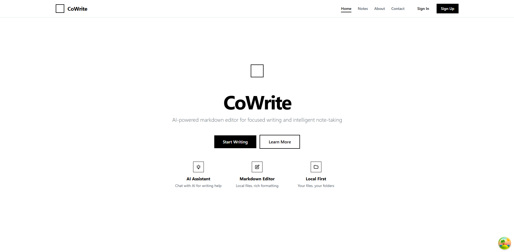
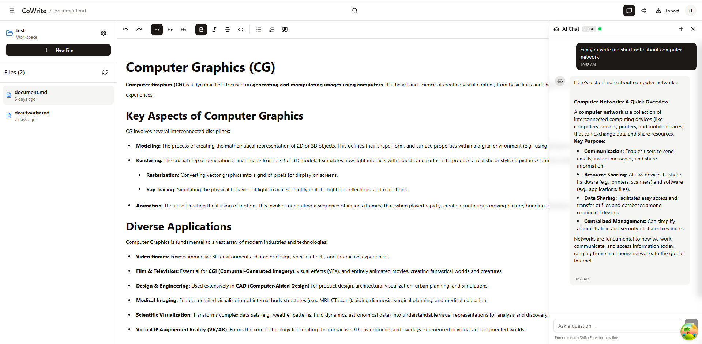
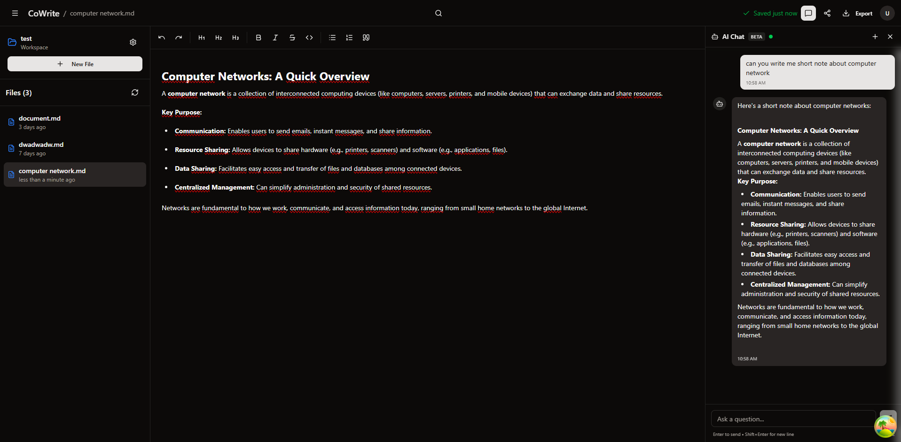
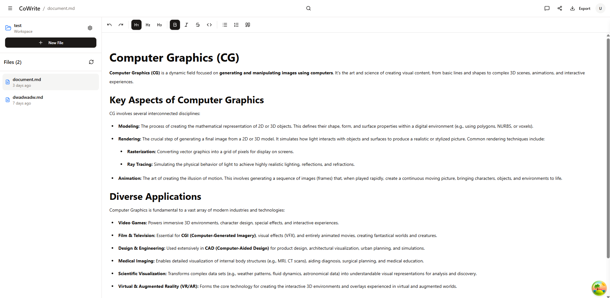
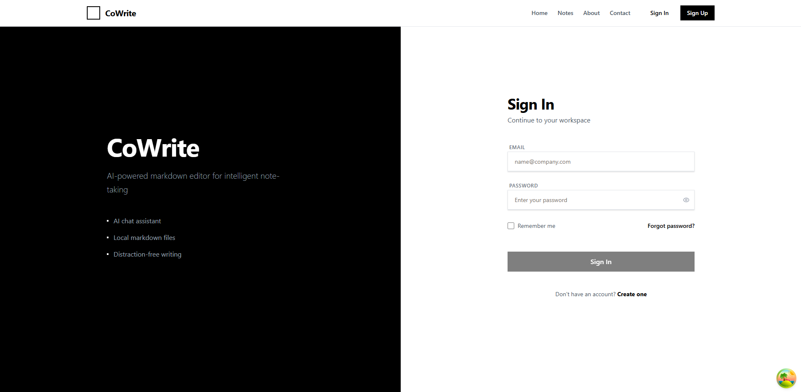
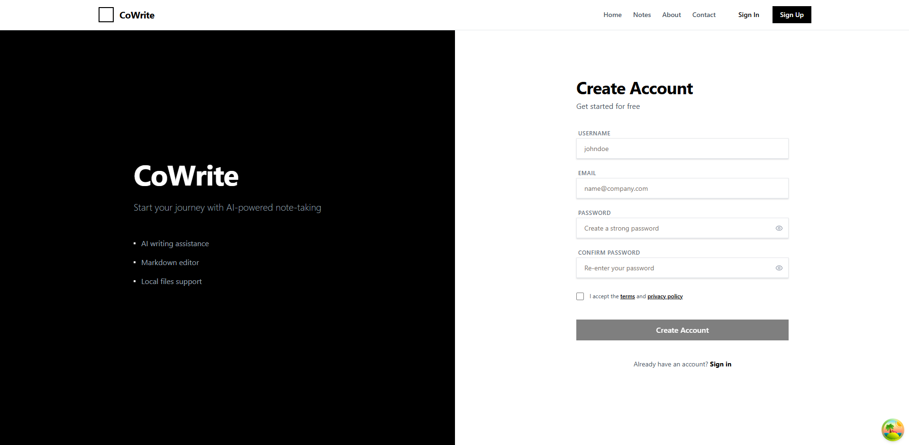

# Co-Write Deployment


## Overview

Co-Write is a modern, AI-powered collaborative note-taking application designed for teams and individuals who want to enhance their productivity with intelligent assistance. This repository contains the production deployment configuration for the Co-Write application stack, orchestrated using Docker Compose and will be deployed on Azure infrastructure in the future.

## What is Co-Write?

Co-Write is an intelligent note-taking platform that combines traditional note management with cutting-edge AI capabilities:

- **Smart Note-Taking**: Create, organize, and manage notes with a rich text editor
- **AI Chat Assistant**: Get instant help, suggestions, and answers while working on your notes
- **Inline AI Suggestions** (Coming Soon): Context-aware recommendations as you type
- **Agent Mode** (Coming Soon): Autonomous AI agents that can help research, summarize, and enhance your content
- **Real-Time Collaboration** (Coming Soon): Work together with your team in real-time
- **Cloud Storage** (Coming Soon): All notes are securely stored and synchronized across devices

## 🖼️ Screenshots

Here are some preview images of the CoWrite Web application:

### Home



### Chat



### Dark Mode



### Notes



### Sign In



### Sign Up



## Services

### 1. **Frontend (Nginx + React)**
- **Container**: `cowrite-web`
- **Port**: `80`
- **Description**: Serves the React single-page application and acts as a reverse proxy for backend services. Routes requests to appropriate microservices based on URL paths.

### 2. **User Service (Spring Boot)**
- **Container**: `cowrite-app`
- **Technology**: Java Spring Boot
- **Description**: Handles all user-related operations including authentication, authorization, registration, and session management.

### 3. **AI Service (Python/FastAPI)**
- **Container**: `cowrite-ai`
- **Technology**: Python with FastAPI
- **Description**: Provides AI-powered features by interfacing with external AI APIs (Google Gemini).

### 5. **Prometheus**
- **Container**: `prometheus`
- **Port**: `9090` (internal), exposed via `/prometheus/` path
- **Description**: Metrics collection and time-series database for monitoring application performance.

### 6. **Grafana (External)**
- **Location**: External Grafana instance
- **Description**: Visualization platform for monitoring dashboards. Connects to Prometheus for data source.

### 7. **Node Exporter**
- **Container**: `node-exporter`
- **Description**: Exports system-level metrics (CPU, memory, disk, network) for Prometheus to scrape.

### 8. **Postgres**
- **Container**: `postgres`
- **Port**: `5432` (internal)
- **Description**: Basic database if we don't have in cloud.

## Prerequisites

- Docker Engine 20.10+
- Docker Compose 2.0+
- Azure account with VM and PostgreSQL resources
- Valid SSL certificates (for production)

## Environment Setup

1. **Clone the repository**:
   ```bash
   git clone https://github.com/jakubzajkowski/cowrite-deployment.git
   cd cowrite-deployment
   ```

2. **Create environment file**:
   ```bash
   cp .env.example .env
   ```

3. **Configure environment variables** (`.env`):
   ```bash
   # Database Configuration
   POSTGRES_USER=your_postgres_user
   POSTGRES_PASSWORD=your_secure_password
   APP_DATABASE_URL=jdbc:postgresql://db:5432/app_db
   AI_DATABASE_URL=postgresql+asyncpg://user:password@db:5432/ai_db
   
   # JWT Configuration
   JWT_SECRET=your_very_long_and_secure_jwt_secret_key
   JWT_EXPIRATION=3600000  # 1 hour in milliseconds
   JWT_COOKIE_NAME=COWRITE_SESSION_ID
   
   # AI Service
   GEMINI_API_KEY=your_google_gemini_api_key
   USER_SERVICE_URL=http://app:8080
   USER_COOKIE_NAME=COWRITE_SESSION_ID
   ```

4. **Set up Basic Authentication for Prometheus**:
   ```bash
   # Install htpasswd utility (if not already installed)
   # On Ubuntu/Debian: apt-get install apache2-utils
   # On Windows: use Docker or WSL
   
   # Create .htpasswd file
   htpasswd -c nginx/.htpasswd admin
   # Enter password when prompted
   ```

5. **Initialize database**:
   - Ensure your Azure PostgreSQL instance is running or use default in compose
   - Update connection strings in `.env` file
   - Initial database schemas will be created automatically via migrations

## Running the Application

**Start all services**:
```bash
docker-compose up -d
```

**View logs**:
```bash
docker-compose logs -f
```

**Stop all services**:
```bash
docker-compose down
```

**Restart specific service**:
```bash
docker-compose restart <service-name>
```

**Update to latest images**:
```bash
docker-compose pull
docker-compose up -d
```

## Prometheus Metrics

Access Prometheus UI at: `http://your-domain/prometheus/`

**Authentication**: Protected with HTTP Basic Auth using credentials from `.htpasswd`

**Available Metrics**:
- JVM metrics (heap usage, garbage collection, thread count)
- HTTP request rates and latencies for fastAPI and Spring Boot
- Database connection pool statistics
- Custom business metrics for fastAPI and Spring Boot
- System resource utilization


## Building Docker Images

Images are built and published to Docker Hub:
- `jakubzajkowski/cowrite-user-service:latest`
- `jakubzajkowski/cowrite-ai-service:latest`
- `jakubzajkowski/cowrite-web:latest`

## Roadmap

- [x] User authentication and authorization
- [x] AI chat functionality
- [x] Monitoring with Prometheus/Grafana
- [ ] Inline AI suggestions
- [ ] Agent mode for autonomous AI operations
- [ ] Real-time collaborative editing
- [ ] Team workspaces
- [ ] Cloud synchronization
- [ ] Mobile applications
- [ ] Advanced analytics dashboard

**Last Updated**: October 2025  
**Deployment Version**: 1.0.0
